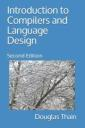

# CSE 40243 - Compilers and Language Design - Fall 2023

## Instructors

|----|----|
|| Prof. Douglas Thain (`dthain@nd.edu`)  Office Hours: 1-3PM Mon/Thu   Office: 384 Fitpatrick Hall|
|| TA: Colin Thomas (`cthoma26@nd.edu`)  Office Hours: 3-5PM Mon/Wed   Office: 150B Fitpatrick Hall (Student Commons)|
|| TA: David Simonetti (`dsimone2@nd.edu`)  Office Hours: 3-5PM Tue/Thu   Office: 150B Fitpatrick Hall (Student Commons)|

## Online Textbook

|----|----|
|| Douglas Thain, Introduction to Compilers and Language Design, 2nd edition, 2021. [http://compilerbook.org](http://compilerbook.org)

## Important Documents

- [Course Syllabus](syllabus.md)
- [Slack Channel](https://nd-cse.slack.com/channels/compilers-fa23)
- [Online Textbook](http://compilerbook.org)
- [Canvas Course Page](https://canvas.nd.edu/courses/70800)
- [Starter Code](https://github.com/dthain/compilerbook-starter-code)
- [General Assignment Instructions](general)
- [Flex Scanner Generator](https://westes.github.io/flex/manual/)
- [Bison Parser Generator](https://www.gnu.org/software/bison/manual/html_node/index.html)

<!-- - [General Assignment Instructions](general.md) -->
<!-- - [B-Minor 2023 Language Guide](bminor.md) -->

## Course Schedule

(Subject to change as needed.)

|Week | Reading      | Monday          | Wednesday     | Thursday     |Friday      | Extra Links |
|-----|--------------|-----------------|---------------|--------------|------------|-------------|
|Aug 21 | Ch 1-2     |                 | Intro         |              | Overview   | [Syllabus](syllabus.md)  |
|Aug 28 | Ch 3       | Regular Expressions   **[HW1 Due](homework.md)** | Finite Automata       | **[Encoder Due](encoder)** | RE->NFA | [Hand Parser](https://github.com/cooperative-computing-lab/cctools/blob/master/dttools/src/jx_parse.c#L254)   [Regex 101](https://regex101.com/)   [Regex Golf](http://alf.nu/RegexGolf?world=regex&level=r02)   [Unicode](https://www.joelonsoftware.com/2003/10/08/the-absolute-minimum-every-software-developer-absolutely-positively-must-know-about-unicode-and-character-sets-no-excuses/) |
|Sep 4  | Ch 3       | NFA->DFA             | Flex           | **HW2 Due**     | Context Free Grammars | [Flex Scanner Generator](https://westes.github.io/flex/manual/)
|Sep 11 | Ch 4.1-4.3 | Context Free Grammars| LL(1) Grammars | **Scanner Due** | LL(1) Parsing    |
|Sep 18 | Ch 4.4-4.6 | Shift-Reduce Parsing | LR(0) Automaton| **HW3 Due**     | SLR Parsing      |
|Sep 25 | Ch 5       | LR(1) and Recap      | Bison          | **HW4 Due**     | Bison            |
|Oct 2  | Ch 5       | Parsing B-Minor      | Parsing B-Minor|                 | Abstract Syntax Tree | [AST Handout](ast.html) |
|Oct 9  | Ch 6       | Abstract Syntax Tree | Review   **Parser Due** |     | **Midterm Exam** |
|Oct 16 |            | *Fall Break*    | *Fall Break*          | *Fall Break*     | *Fall Break*      |
|Oct 23 | Ch 7       | Type Systems    | Name Resolution       | **Printer Due**  | Typechecking      |
|Oct 30 | Ch 9       | Memory Org      | Memory Org            |                  | Memory Org        |
|Nov 6  | Ch 10      | Assembly        | Assembly              | **Typechecker Due** | Assembly       |
|Nov 13 | Ch 11      | Codegen         | Codegen               |                  | Codegen           |
|Nov 20 | Ch 11      | Codegen         | *Thanksgiving*        | *Thanksgiving*   | *Thanksgiving*    |
|Nov 27 | Ch 12      | Optimization    | Garbage Coll.         |                  |  Garbage Coll.    |
|Dec 4  |            | Catch Up        | Review  **Code Generator Due** |      |                   |
|Dec 11 |            | **Final Exam 8-10AM** |                 |                  |                    |

<!--

[CFG Tool](https://web.stanford.edu/class/archive/cs/cs103/cs103.1156/tools/cfg/)
[Joke](https://xkcd.com/1090/)
[Intel Manuals](https://www.intel.com/content/www/us/en/developer/articles/technical/intel-sdm.html)
[Calling Convention](https://refspecs.linuxbase.org/elf/x86_64-abi-0.99.pdf)
[Bison Manual](https://www.gnu.org/software/bison/manual/html_node/index.html)
[Bison Examples](https://github.com/dthain/compilerbook-examples/tree/master/chapter5)
-->
